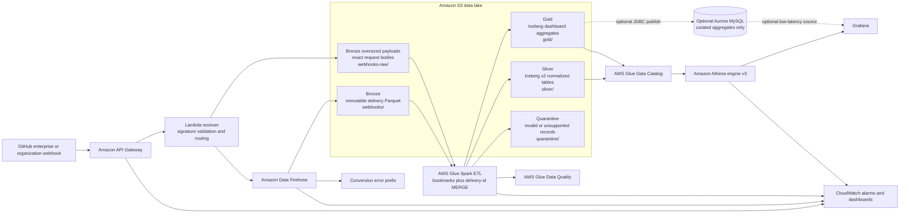
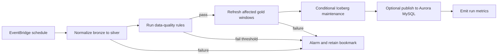

# GitHub Webhook Analytics Architecture Recommendations

## Executive recommendation

> **Implementation status (2026-09-03):** Phase 2 is implemented for the
> webhook silver core and six event-family tables. The deployed Glue job reads
> bronze Parquet directly from S3, performs replay-safe Iceberg v2 merges,
> quarantines validation and payload-hash conflicts, and runs hourly. Phase 0
> receiver hardening and the gold layer remain separate follow-up work.

Retain the current Amazon API Gateway → Amazon Data Firehose → Amazon S3 pipeline as the **bronze ingestion layer**, then add a scheduled AWS Glue Spark job that produces **Apache Iceberg v2 silver tables** and a small set of **gold aggregate tables** for dashboards.

Do **not** create one physical table for every GitHub event type or event/action pair. GitHub's webhook model is polymorphic and evolves over time; a table-per-action design creates catalog sprawl, duplicated ETL logic, brittle schema management, and dashboards that must union many tiny tables.

The recommended shape is:

1. **Bronze:** immutable delivery records in the existing Parquet table, preserving `raw_payload`.
2. **Silver core:** one deduplicated `events` Iceberg table with common typed dimensions and the full payload.
3. **Silver families:** only a few tables for stable, high-value domains, such as Actions, pull requests, issues, security alerts, and organization administration.
4. **Gold:** compact, dashboard-specific hourly and daily aggregates.
5. **Serving:** query gold tables directly from Grafana through Athena first. Add Amazon Aurora MySQL only if interactive concurrency or latency proves Athena insufficient.

The key idempotency rule is: **one canonical row per `X-GitHub-Delivery` value**, represented by `delivery_id`. GitHub redeliveries keep the same delivery identifier, and Firehose retries can also duplicate records, so every materialization path must be safe to rerun.

## Target architecture



### Important ingestion constraint

GitHub permits webhook payloads up to 25 MB, while a Firehose `PutRecord` data blob is limited to 1,000 KiB. The current direct API Gateway-to-Firehose path therefore cannot guarantee capture of every valid GitHub webhook, especially large `push` events. Treat this as a production design gap.

For production, insert a small Lambda receiver between API Gateway and Firehose. It should:

- validate `X-Hub-Signature-256` against the exact, unmodified request bytes;
- reject missing or invalid signatures with `401` or `403`;
- preserve all relevant GitHub delivery headers;
- route records that fit the Firehose limit to Firehose;
- write oversized payloads directly to an immutable S3 raw prefix and emit a compact pointer record for downstream processing;
- return a success response only after durable acceptance;
- use a webhook secret stored in AWS Secrets Manager, not in the template or source tree.

If the pipeline is deliberately restricted to payloads below 1,000 KiB, document and alarm on that contract rather than silently losing larger events.

## Layer responsibilities

| Layer | Purpose | Format | Mutation model | Typical consumers |
| --- | --- | --- | --- | --- |
| Bronze | Source-faithful audit and replay | Existing Parquet plus `raw_payload`; exact raw objects for oversized events | Append-only and immutable | ETL, forensics, replay |
| Silver core | Canonical delivery fact with common typed fields | Iceberg v2 / Parquet | Idempotent `MERGE` by `delivery_id` | Athena exploration, downstream ETL |
| Silver family | Typed fields for a bounded set of analytical domains | Iceberg v2 / Parquet | Idempotent `MERGE` by family grain | Analysts, reusable semantic views |
| Gold | Precomputed dashboard metrics | Iceberg v2 / Parquet | Rebuild or merge affected time windows | Grafana, exports |
| Serving cache | Optional low-latency relational copy | Aurora MySQL | Transactional upsert | High-concurrency Grafana panels |

### Why Iceberg v2 for silver and gold

Iceberg is preferable to unmanaged Hive-style Parquet for the curated layers because it supports:

- atomic commits and transactional row-level operations;
- `MERGE INTO` for replay-safe deduplication and corrections;
- schema and partition evolution without rewriting consumers;
- hidden partitioning, reducing partition-column mistakes in queries;
- time travel for validation and recovery;
- compaction and snapshot expiration operations.

Athena engine version 3 creates and operates on Iceberg v2 tables. Keep v2 for interoperability even if a newer Glue release can create Iceberg v3; Athena compatibility is the governing constraint.

## Catalog and S3 layout

Use separate Glue databases to make lifecycle, permissions, and table intent obvious:

- `github_webhooks_bronze_dev`
- `github_webhooks_silver_dev`
- `github_webhooks_gold_dev`

The deployed `github_webhooks_dev.events` table can remain as a compatibility name during migration, or be treated as the bronze table until a planned rename.

Recommended S3 prefixes in the existing environment bucket:

```text
s3://github-webhooks-parquet-dev-953721827634/
├── webhooks/                         # current bronze Parquet
│   └── year=YYYY/month=MM/day=DD/
├── webhooks-raw/                     # optional exact bodies for >1,000 KiB records
│   └── ingest_date=YYYY-MM-DD/hour=HH/
├── webhooks-errors/                  # Firehose failures
├── quarantine/                       # ETL parse/schema/data-quality failures
│   └── ingest_date=YYYY-MM-DD/reason=.../
├── silver/
│   ├── events/
│   ├── actions_workflow_runs/
│   ├── actions_workflow_jobs/
│   ├── pull_requests/
│   ├── issues/
│   ├── security_alerts/
│   └── organization_activity/
├── gold/
│   ├── event_activity_hourly/
│   ├── repository_activity_daily/
│   ├── actions_usage_daily/
│   ├── pull_request_flow_daily/
│   └── security_alert_activity_daily/
└── athena-results/                   # existing Athena workgroup output
```

Use distinct KMS keys or key policies where raw payload sensitivity differs from aggregates. Do not point an Iceberg table at a prefix shared with non-Iceberg files.

## Bronze layer

The current table is a useful ingestion index because it contains common fields and `raw_payload`. Preserve it as immutable source evidence. Bronze should answer these questions:

- What exact delivery did the endpoint accept?
- Which GitHub headers and ingestion metadata accompanied it?
- Can any silver or gold table be rebuilt from source?
- Which records failed conversion or normalization?

### Recommended bronze metadata

Add these fields at ingestion when the receiver is introduced:

| Column | Type | Notes |
| --- | --- | --- |
| `delivery_id` | string | `X-GitHub-Delivery`; primary idempotency key |
| `event_type` | string | `X-GitHub-Event` |
| `hook_id` | bigint | `X-GitHub-Hook-ID` |
| `target_type` | string | Installation target type header |
| `target_id` | bigint | Installation target ID header |
| `content_type` | string | Expected to be `application/json` |
| `signature_sha256` | string | Optional evidence; restrict access and do not use as a secret |
| `signature_valid` | boolean | Must be true before acceptance |
| `received_at` | timestamp | Receiver timestamp in UTC |
| `source_ip` | string | Optional operational field; apply privacy and retention policy |
| `payload_size_bytes` | bigint | Enables payload-limit monitoring |
| `raw_payload` | string | Exact JSON body, not reserialized JSON |
| `ingest_year`, `ingest_month`, `ingest_day`, `ingest_hour` | string | Physical delivery partitions if retaining Hive layout |

Do not infer webhook occurrence time exclusively from S3 path time. Store `received_at`, then derive a domain `event_at` during normalization from the most appropriate payload field.

## Immediate Athena access

Before building Glue ETL, create Athena views over the existing bronze table to validate analytical requirements. This gives fast value without locking the lake into premature schemas.

Example discovery query:

```sql
SELECT
    event_type,
    action,
    count(*) AS deliveries,
    approx_distinct(id) AS distinct_deliveries,
    avg(length(raw_payload)) AS average_payload_chars,
    max(length(raw_payload)) AS maximum_payload_chars
FROM github_webhooks_dev.events
WHERE year = '2026'
  AND month = '08'
GROUP BY 1, 2
ORDER BY deliveries DESC;
```

Example view for Actions workflow jobs:

```sql
CREATE OR REPLACE VIEW github_webhooks_dev.v_workflow_jobs AS
SELECT
    id AS delivery_id,
    from_iso8601_timestamp(
        json_extract_scalar(raw_payload, '$.workflow_job.created_at')
    ) AS event_at,
    json_extract_scalar(raw_payload, '$.organization.login') AS organization_login,
    repository.id AS repository_id,
    repository.full_name AS repository_full_name,
    sender.id AS sender_id,
    sender.login AS sender_login,
    action,
    CAST(json_extract_scalar(raw_payload, '$.workflow_job.id') AS bigint) AS workflow_job_id,
    CAST(json_extract_scalar(raw_payload, '$.workflow_job.run_id') AS bigint) AS workflow_run_id,
    json_extract_scalar(raw_payload, '$.workflow_job.name') AS job_name,
    json_extract_scalar(raw_payload, '$.workflow_job.status') AS status,
    json_extract_scalar(raw_payload, '$.workflow_job.conclusion') AS conclusion,
    CAST(json_extract(raw_payload, '$.workflow_job.labels') AS array(varchar)) AS runner_labels,
    raw_payload
FROM github_webhooks_dev.events
WHERE event_type = 'workflow_job';
```

Views are appropriate for exploration and low-volume use. Materialize a field into silver when it becomes a frequent filter, join key, grouping dimension, data-quality requirement, or dashboard dependency.

## Silver table design

### Core table: `silver.events`

Create one canonical row per delivery. A practical schema is:

| Column | Type | Purpose |
| --- | --- | --- |
| `delivery_id` | string, not null | Canonical delivery identifier |
| `event_type` | string, not null | GitHub event name |
| `action` | string | Event action when applicable |
| `event_family` | string | Controlled domain classification |
| `received_at` | timestamp, not null | UTC ingestion timestamp |
| `event_at` | timestamp | Best available domain timestamp |
| `organization_id` | bigint | Stable organization join key |
| `organization_login` | string | Human-readable organization |
| `enterprise_id` | bigint | Enterprise join key when present |
| `enterprise_slug` | string | Enterprise dimension |
| `repository_id` | bigint | Stable repository join key |
| `repository_full_name` | string | Display dimension |
| `repository_visibility` | string | Public/private/internal if present |
| `sender_id` | bigint | Actor key when present |
| `sender_login` | string | Actor display name; may be `ghost` |
| `payload_version` | integer | Internal normalization contract version |
| `raw_payload` | string | Escape hatch and replay source |
| `bronze_object_path` | string | Lineage to source file/object |
| `normalized_at` | timestamp | ETL processing time |

Recommended partition specification:

```text
day(received_at), bucket(32, repository_id)
```

Use only `day(received_at)` initially if volume is modest. Add bucketing only after query evidence shows repository-level pruning or write distribution needs it. Avoid partitioning by `event_type` or `action`; those values can be skewed, evolve frequently, and create many small partitions.

### Event-family tables

Create a family table only when its fields have a durable analytical use case. Good initial candidates are:

| Table | Grain | Examples of typed fields |
| --- | --- | --- |
| `actions_workflow_runs` | one workflow-run delivery state | run ID, workflow ID/name, status, conclusion, attempt, branch, actor, created/started/updated times |
| `actions_workflow_jobs` | one workflow-job delivery state | job ID, run ID, status, conclusion, runner name/group, labels, queued/started/completed times |
| `pull_requests` | one PR delivery state | PR ID/number, draft, merged, author, base/head refs, additions/deletions, created/closed/merged times |
| `issues` | one issue delivery state | issue ID/number, state, state reason, type, author, assignees, labels, created/closed times |
| `security_alerts` | one alert delivery state | alert kind, alert number, state, severity, resolution, timestamps |
| `organization_activity` | one organization/admin delivery | member/team/repository subject IDs, role, visibility, policy-change attributes |

Keep unusual or low-volume event types in `silver.events` and query their `raw_payload` until a clear analytical contract exists. This prevents a large, mostly empty catalog.

### Arrays and one-to-many entities

Do not flatten every nested array into the event row. Create child tables only where array-level analytics are needed, for example:

- `push_commits`, keyed by `delivery_id` plus commit SHA;
- `workflow_job_labels`, keyed by `delivery_id`, job ID, and label;
- `issue_labels`, keyed by `delivery_id`, issue ID, and label ID/name;
- `pull_request_requested_reviewers`, keyed by delivery and reviewer ID.

This preserves analytical grain and avoids multiplying facts unexpectedly.

## Deduplication, replay, and late data

### Canonical rule

Use `delivery_id` as the source delivery key. Keep a bronze row for every accepted attempt if audit requirements demand it, but expose one canonical silver row per delivery.

For duplicate deliveries, prefer the record that is:

1. signature-valid;
2. parse-valid;
3. the latest accepted copy when payloads are byte-identical;
4. explicitly quarantined for review when the same delivery ID has conflicting payload hashes.

Compute `payload_sha256` at ingestion. A duplicate ID with a different payload hash should be observable, not silently overwritten.

For the existing pre-verification bronze history, preserve an explicit trust state such as `legacy_unverified`; do not retroactively label those rows signature-valid.

### Incremental ETL algorithm

Each Glue run should:

1. Read only newly discovered bronze objects using Glue job bookmarks or an explicit S3 manifest/watermark.
2. Parse `raw_payload` and project common fields.
3. Validate required keys and timestamps.
4. Deduplicate the current batch by `delivery_id`.
5. Merge into `silver.events` using `delivery_id`.
6. Derive and merge rows into applicable family tables.
7. Recompute or merge the affected gold time windows.
8. Write invalid records to quarantine with a reason and source lineage.
9. Commit the bookmark only after all required table and quarantine writes succeed.

Bookmarks reduce source rescans, but they are **not** the correctness boundary. Glue bookmarks use S3 object modification times, output cleanup is not automatic on rewind, and event-driven Glue does not deduplicate duplicate EventBridge notifications. Correctness must come from Iceberg merges and deterministic keys.

Use a Spark Iceberg `MERGE INTO` with `delivery_id` for the core table. For stateful entities such as workflow runs, a second curated "latest state" table can merge by the domain key (`workflow_run_id`) while retaining the delivery history table for event analysis.

### Backfills

A backfill must accept a bounded date/path range and write through the same normalization functions as the incremental job. Never maintain separate transformation logic for historical loads. Use a distinct job run identifier and report inserted, updated, unchanged, and quarantined counts.

## Orchestration

Start with a schedule rather than one Glue run per S3 object:

- Run every 15 minutes for near-real-time dashboards, or hourly if freshness requirements allow.
- Use one concurrent run at a time to avoid unnecessary Iceberg commit contention.
- Add retries with exponential backoff and alarms on terminal failure.
- Use EventBridge Scheduler for a simple pipeline; use AWS Step Functions when orchestration needs multiple jobs, quality gates, retries, or a MySQL publish step.

An S3/EventBridge-triggered Glue workflow is reasonable for irregular traffic, but batch object notifications over a window and retain the same idempotency rules. AWS explicitly notes that Glue does not guarantee EventBridge delivery or deduplicate messages.

Suggested workflow:



## Data quality and schema evolution

Apply AWS Glue Data Quality rules to silver output. Begin with:

- `delivery_id`, `event_type`, and `received_at` completeness = 100%;
- `delivery_id` uniqueness = 100% in the canonical core table;
- `signature_valid` = true for all accepted production data;
- `raw_payload` JSON parse success above the agreed threshold;
- valid `event_at` range, allowing known late arrivals;
- repository ID completeness measured by event type, not globally;
- allowed values for controlled classifications such as `event_family`;
- referential checks between family rows and `silver.events`.

GitHub events do not all include a repository, and `sender` can be a placeholder user such as `ghost`; do not make those fields universally mandatory.

### Schema policy

- Add nullable typed columns when a field is promoted from JSON.
- Never break dashboards by renaming or retyping columns in place without a compatibility view.
- Version normalization logic with `payload_version`.
- Keep `raw_payload` so new fields can be backfilled.
- Maintain a small mapping registry in source control: event type → family, event timestamp selector, domain key, and promoted fields.
- Quarantine type conflicts rather than coercing silently.

## Gold model for Grafana

Gold tables should match dashboard query patterns and remain small enough for fast scans. Recommended initial tables:

### `gold.event_activity_hourly`

Grain: hour × organization × event type × action.

Measures:

- delivery count;
- distinct delivery count;
- distinct repositories;
- distinct senders;
- parse/quarantine count;
- average and maximum payload size.

### `gold.repository_activity_daily`

Grain: day × organization × repository.

Measures:

- pushes and commits;
- pull requests opened, merged, and closed;
- issues opened and closed;
- workflow runs and jobs;
- active contributors;
- security alert state changes.

### `gold.actions_usage_daily`

Grain: day × organization × repository × workflow.

Measures:

- run and job counts;
- success, failure, cancelled, and timed-out counts;
- queue duration percentiles;
- execution duration percentiles;
- runner-label usage;
- rerun rate.

Do not compute additive totals from repeated lifecycle webhook states without domain-key deduplication. For example, `workflow_job` sends queued, in-progress, and completed events; job counts must use job IDs and a defined state model rather than counting all deliveries as separate jobs.

### `gold.pull_request_flow_daily`

Grain: day × organization × repository.

Measures:

- opened, merged, and closed counts;
- median and percentile time to first review;
- median and percentile time to merge;
- review and comment activity;
- draft-to-ready transitions.

Webhook-only metrics reflect events captured after installation. They do not automatically provide current inventory or historical state; enrich from GitHub APIs only if the analytical requirement needs a complete snapshot.

## Grafana and serving choices

### Recommended first choice: Grafana → Athena

Use Athena as the Grafana data source against gold tables and views. This keeps the system serverless and avoids maintaining a second copy of the dataset.

Controls to add:

- a dedicated Athena workgroup for Grafana, separate from ad hoc analysis;
- enforced result location and encryption;
- per-query and workgroup data-scan controls;
- short dashboard refresh intervals only where justified;
- Grafana variables backed by small dimension views;
- explicit time predicates in every panel;
- result reuse/caching where supported by the selected Grafana data source;
- gold tables with compact files to reduce scan latency and cost.

### Add Aurora MySQL only when justified

Use Aurora MySQL as a serving cache, not as the lake's source of truth. Add it when measured requirements show one or more of:

- sustained concurrent dashboard users;
- sub-second panel latency requirements;
- many repeated small point/range queries;
- complex application APIs better served by indexes;
- Athena scan cost remains high after gold aggregation and query tuning.

Publish only gold aggregates and compact dimensions through a Glue JDBC connection or a purpose-built loader. Use Secrets Manager for credentials, private subnets, TLS, and transactional upserts keyed by the table grain. Keep the authoritative history in S3/Iceberg so Aurora can be rebuilt.

Avoid loading all raw webhook JSON into MySQL. It adds cost, duplicates the lake, complicates schema evolution, and gives poor value for analytics.

## File sizing and Iceberg maintenance

Firehose's time-based buffering can create small bronze Parquet files at low traffic. Accept that in bronze and compact the curated layers.

- Target roughly 128–512 MiB data files for mature silver/gold tables; tune from observed query and write volume.
- Write sorted or clustered data when it benefits dominant filters, without over-partitioning.
- Run `OPTIMIZE ... REWRITE DATA USING BIN_PACK` on active partitions when small-file thresholds are exceeded, not blindly after every ETL run.
- Run `VACUUM` on a retention schedule that preserves the required rollback window.
- Monitor Iceberg metadata growth, data-file count, delete-file count, and average file size.
- Restrict maintenance predicates to partition columns, as Athena `OPTIMIZE` requires.

At the current low-volume stage, weekly maintenance is likely sufficient. Move to metric-driven daily maintenance only after ingest volume warrants it.

## Security and governance

### Critical controls

1. **Validate webhook signatures before Firehose.** API Gateway mapping alone does not prove the sender is GitHub and cannot safely perform the required HMAC validation against the exact body.
2. **Keep secrets out of CloudFormation parameters and source control.** Store the webhook secret in Secrets Manager and grant only the receiver permission to read it.
3. **Encrypt data and query results.** Prefer customer-managed KMS keys for production if key-level separation or audit requirements apply.
4. **Use least-privilege IAM.** Separate receiver, Firehose, Glue writer, Athena reader, Grafana, and optional JDBC publisher roles.
5. **Restrict S3 prefixes.** Dashboard principals should read gold and selected silver data, not raw payloads or quarantine by default.
6. **Protect sensitive payload content.** Issue bodies, comments, user data, security alerts, and secret-scanning metadata can be sensitive. Apply Lake Formation column/row permissions if multiple audiences share the lake.
7. **Use private networking where practical.** Add S3, Glue, Secrets Manager, CloudWatch, and KMS VPC endpoints for VPC-bound Glue/Aurora paths.
8. **Record lineage.** Keep source object path, delivery ID, normalizer version, and processing run ID.

### Retention

Define different retention policies by layer:

- bronze/raw: based on audit and replay requirements;
- errors/quarantine: long enough to investigate and replay, with owner and SLA;
- silver: analytical history requirement;
- gold: rebuildable and often shorter-lived;
- Athena results: short lifecycle unless results themselves are audit artifacts;
- Iceberg snapshots/orphan files: explicit maintenance retention.

Use S3 lifecycle transitions for cold bronze data only after verifying that the selected storage class remains compatible with expected query/replay behavior. Athena Iceberg tables should not place active table objects in Glacier classes.

## Observability and service-level indicators

Emit and alarm on the complete path, not only the API response:

| Signal | Why it matters |
| --- | --- |
| API 2xx/4xx/5xx and latency | Receiver health and signature failures |
| Accepted deliveries by event type | Ingestion baseline and unexpected traffic changes |
| Missing/invalid signatures | Security control effectiveness |
| Payload size percentiles and >900 KiB count | Firehose limit risk |
| Firehose incoming vs delivered records | Delivery loss or backlog |
| Firehose conversion failures | Schema/serialization regressions |
| Oldest unprocessed bronze object age | End-to-end freshness |
| Glue run duration, DPU use, failures, retries | ETL health and cost |
| Rows read/inserted/updated/quarantined | Reconciliation and idempotency |
| Duplicate delivery IDs and conflicting hashes | Replay behavior or integrity anomalies |
| Data-quality pass/fail metrics | Contract health |
| Athena bytes scanned and failed queries by workgroup | Dashboard cost and query regressions |
| Gold maximum event date/time | Dashboard freshness |
| Iceberg file and snapshot counts | Maintenance need |

Define initial objectives such as:

- accepted-to-bronze durability: immediate after receiver success;
- bronze-to-silver freshness: 30 minutes at the 99th percentile;
- silver-to-gold freshness: 45 minutes at the 99th percentile;
- uninvestigated quarantine records: zero beyond one business day;
- canonical duplicate delivery IDs: zero.

Reconcile daily counts between accepted receiver requests, Firehose delivery, bronze distinct delivery IDs, silver rows, and quarantine rows.

## Cost controls

- Keep bronze immutable and compact only downstream; rewriting raw source adds cost without analytical benefit.
- Restrict Athena queries by time and use workgroup scan limits.
- Materialize only frequently reused payload fields.
- Build a few reusable gold aggregates rather than many dashboard-specific copies.
- Prefer scheduled micro-batches over one Glue Spark job per webhook or S3 object.
- Right-size Glue workers after collecting run metrics; small data may be cheaper with Athena CTAS/MERGE or a lightweight Lambda batch, while Glue becomes valuable as volume and transform complexity grow.
- Compact only when file metrics cross thresholds.
- Lifecycle Athena results, temporary ETL data, old quarantine artifacts, and obsolete snapshots.
- Tag resources by environment, owner, data layer, and cost center.

## Failure handling and recovery

| Failure | Response |
| --- | --- |
| Invalid signature | Reject; metric and rate-limit; do not persist as trusted data |
| Payload above Firehose limit | Store exact body directly in S3; emit pointer metadata |
| Firehose conversion error | Alarm, retain error object, replay after mapping fix |
| JSON parse or required-key error | Quarantine with delivery ID, hash, source path, and reason |
| Glue partial failure | Do not advance the bookmark; rerun safely through merges |
| Duplicate EventBridge notification | Harmless because source and sink operations are idempotent |
| Conflicting payload for delivery ID | Quarantine and alert; do not silently replace canonical data |
| Gold refresh failure | Keep prior committed snapshot; retry affected windows |
| Aurora publish failure | Athena path remains authoritative; retry transactional upsert |

Maintain a replay utility that accepts delivery IDs, S3 objects, or date ranges and invokes the same normalization contract as the standard job.

## Phased implementation roadmap

### Phase 0 — Harden current ingestion

- Standardize the GitHub webhook on `application/json`.
- Add signature validation using a Lambda receiver and Secrets Manager.
- Preserve exact request bytes and all useful delivery headers.
- Add payload-size monitoring and the direct-to-S3 oversized path.
- Alarm on Firehose conversion errors and accepted-versus-delivered discrepancies.
- Keep the current table and endpoint behavior stable while introducing these controls.

**Exit criteria:** unsigned/tampered payloads are rejected, every accepted payload size has a durable route, and delivery failures page an owner.

### Phase 1 — Prove the analytical model with Athena

- Add bronze discovery views for the highest-value event families.
- Profile event/action frequency, JSON paths, payload size, null rates, and lifecycle duplication.
- Agree on the first Grafana metrics and freshness objectives.
- Document field definitions and domain grains.

**Exit criteria:** dashboard requirements and promoted fields are based on observed data rather than every possible webhook schema.

### Phase 2 — Build silver Iceberg tables

- Create the silver Glue database and `events` Iceberg v2 table.
- Implement one Glue Spark normalization job with bookmarks plus `delivery_id` merges.
- Add Actions tables first if Actions dashboards are the primary use case.
- Add quarantine, lineage, run metrics, and Glue Data Quality rules.
- Backfill existing bronze data through the same code path.

**Exit criteria:** rerunning any input range produces no duplicate canonical rows, and all source rows reconcile to silver or quarantine.

### Phase 3 — Add gold and Grafana

- Create hourly event activity and the first domain daily aggregate.
- Configure a dedicated Grafana Athena workgroup with scan controls.
- Build dashboards with mandatory time filters and freshness panels.
- Measure panel latency, concurrency, and scan cost.

**Exit criteria:** dashboards meet agreed latency/freshness at an acceptable Athena cost.

### Phase 4 — Operate and optimize

- Add metric-driven Iceberg `OPTIMIZE` and scheduled `VACUUM`.
- Tune file size, partition specification, Glue workers, and aggregate grain from evidence.
- Introduce Lake Formation if audience-specific access requires it.
- Add Aurora MySQL only if measured dashboard behavior justifies another serving system.

**Exit criteria:** maintenance is automated, costs are bounded, recovery is tested, and any relational serving tier has a documented performance case.

## Decisions to avoid

- **No table per event/action.** Use one core table, a bounded number of family tables, and views.
- **No crawler as the primary Iceberg writer.** The ETL engine should create and transactionally update curated tables; crawlers are optional for discovery/migration.
- **No job bookmark as deduplication.** It is only an incremental-read optimization.
- **No raw JSON lake in MySQL.** Publish only curated aggregates/dimensions if MySQL is needed.
- **No partition by every common filter.** Partition from measured volume and query patterns; begin with event date.
- **No success metric based solely on GitHub's HTTP 200.** Observe Firehose conversion, S3 delivery, normalization, data quality, and gold freshness.
- **No signature validation after body transformation.** Validate the exact raw bytes first.

## Recommended first deliverable

The smallest production-worthy increment is:

1. one signature-validating receiver with an oversized-payload S3 route;
2. one `github_webhooks_silver_dev.events` Iceberg v2 table;
3. one scheduled Glue job using a bookmark for efficient reads and `delivery_id` for correctness;
4. one quarantine prefix and reconciliation report;
5. one `event_activity_hourly` gold table;
6. one Grafana/Athena dashboard showing traffic, failures, freshness, and top event types.

This establishes the durable architecture without prematurely modeling every GitHub webhook.

## Official references

- [GitHub: Webhook events and payloads](https://docs.github.com/en/webhooks/webhook-events-and-payloads)
- [GitHub: Validating webhook deliveries](https://docs.github.com/en/webhooks/using-webhooks/validating-webhook-deliveries)
- [Amazon Data Firehose: `PutRecord`](https://docs.aws.amazon.com/firehose/latest/APIReference/API_PutRecord.html)
- [Amazon Athena: Query JSON data](https://docs.aws.amazon.com/athena/latest/ug/querying-JSON.html)
- [Amazon Athena: CTAS](https://docs.aws.amazon.com/athena/latest/ug/ctas.html)
- [Amazon Athena: Query Apache Iceberg tables](https://docs.aws.amazon.com/athena/latest/ug/querying-iceberg.html)
- [Amazon Athena: Create Iceberg tables](https://docs.aws.amazon.com/athena/latest/ug/querying-iceberg-creating-tables.html)
- [Amazon Athena: `MERGE INTO`](https://docs.aws.amazon.com/athena/latest/ug/merge-into-statement.html)
- [Amazon Athena: `OPTIMIZE`](https://docs.aws.amazon.com/athena/latest/ug/optimize-statement.html)
- [Amazon Athena: Partition projection](https://docs.aws.amazon.com/athena/latest/ug/partition-projection.html)
- [AWS Glue: Using Apache Iceberg](https://docs.aws.amazon.com/glue/latest/dg/aws-glue-programming-etl-format-iceberg.html)
- [AWS Glue: Job bookmarks](https://docs.aws.amazon.com/glue/latest/dg/monitor-continuations.html)
- [AWS Glue: Starting workflows with EventBridge](https://docs.aws.amazon.com/glue/latest/dg/starting-workflow-eventbridge.html)
- [AWS Glue: Data Quality](https://docs.aws.amazon.com/glue/latest/dg/data-quality-gs-studio.html)
- [AWS Glue: JDBC connections](https://docs.aws.amazon.com/glue/latest/dg/aws-glue-programming-etl-connect-jdbc-home.html)
