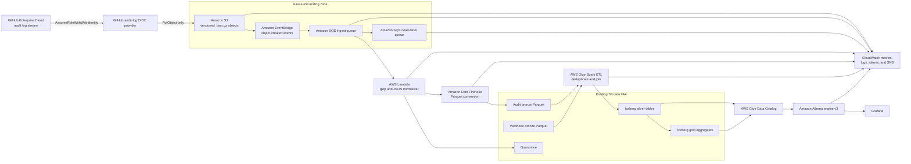
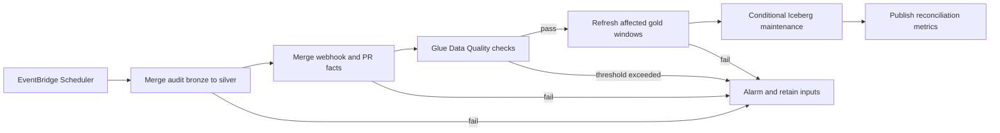

# GitHub Audit Log Streaming and Analytics Plan

Last reviewed: 2026-09-02

## Executive recommendation

Stream GitHub Enterprise Cloud audit logs directly to a dedicated Amazon S3
bronze bucket using GitHub's audit-log OpenID Connect (OIDC) provider. Keep the
GitHub-delivered `.json.gz` objects immutable and independently replayable.

The implemented asynchronous bronze path:

1. Amazon S3 sends object-created events through Amazon EventBridge to Amazon
   SQS.
2. An AWS Lambda function reads each gzip object, validates and flattens common
   audit fields, and writes newline-delimited records to a dedicated Amazon Data
   Firehose delivery stream.
3. Firehose converts the normalized records to partitioned Parquet in the
   existing data-lake bucket.
Future phases add the curated path:

4. A scheduled AWS Glue job merges audit records and webhook-derived entities
   into Apache Iceberg v2 silver tables.
5. The job refreshes compact gold aggregates designed for Grafana panels.
6. Grafana queries the gold tables through a dedicated Amazon Athena workgroup.

Use `_document_id` as the preferred audit-event deduplication key. GitHub audit
streaming is at-least-once, so duplicate delivery is expected. Preserve the
original JSON and source S3 object key for replay and for fields that have not
yet been promoted into the analytical schema.

## Scope and assumptions

This plan assumes:

- GitHub Enterprise Cloud audit-log streaming is available for the enterprise.
- An enterprise owner can configure the stream.
- The AWS deployment account is the data-lake account.
- `us-west-2` remains the deployment region from `samconfig.toml`.
- Dashboard freshness of 15 to 30 minutes is initially acceptable.
- Athena is the first serving engine; a database serving tier is added only
  after measured latency or concurrency requires it.
- The existing webhook pipeline remains operational and is not repurposed for
  audit-log ingestion.

The GitHub enterprise slug is a deployment input. It is case-sensitive in the
OIDC subject condition and must match the enterprise name used by GitHub.

GitHub Enterprise Cloud with data residency currently does not support audit
log streaming to S3 with OIDC. For that case, use the documented access-key
method temporarily, store the credential outside source control, rotate it,
and replace it with OIDC when GitHub makes the feature available.

## Source behavior that governs the design

GitHub's documented S3 stream has these properties:

- It includes enterprise and organization audit events and Git events from the
  time streaming is enabled.
- Delivery is at least once, so an event can appear more than once.
- Files are gzip-compressed JSON and use GitHub-generated date paths and UUID
  filenames.
- A paused stream retains up to seven days of buffered data. After longer
  pauses, continuity is not guaranteed as described in GitHub's documentation.
- GitHub runs a stream health check every 24 hours. Enterprise owners receive
  an email when the endpoint is unhealthy, and a broken configuration must be
  repaired within six days to avoid dropped events.
- Streaming can be configured for multiple endpoints, but that capability is
  currently a public preview.
- Security-relevant `api.request` events are optional and must be enabled in
  the enterprise audit-log settings.
- Copilot agent session activity can also be streamed where the public preview
  and enterprise configuration permit it.

Most enterprise audit events contain common fields such as `@timestamp`,
`_document_id`, `action`, `actor`, `actor_id`, `business`, `business_id`,
`operation_type`, `org`, `org_id`, `repo`, `repo_id`, `repository`,
`repository_id`, `request_id`, `user`, and `user_id`. Event-specific fields are
polymorphic and evolve, so the raw payload must remain available.

Do not create a final Glue table until at least one real stream object has been
inspected. The first-object check must confirm whether each gzip file contains
a top-level JSON array, newline-delimited JSON objects, or another envelope,
and must record the actual timestamp and identifier types. The normalizer can
then support the observed contract explicitly.

## Recommended architecture



## Why use a dedicated raw bucket

GitHub writes its own date hierarchy rather than the Hive-style prefixes used
by the current webhook Firehose stream. A separate raw bucket provides:

- a narrow `s3:PutObject` destination for the GitHub OIDC role;
- independent retention, legal hold, replication, and access policy;
- isolation of sensitive audit and API-request content;
- clean S3 notifications without reacting to webhook, Athena-result, or
  curated-table writes;
- a stable replay source if normalization logic changes;
- protection from accidental deletion through versioning and CloudFormation
  retain policies.

The raw bucket is a source-of-record landing zone, not the main Grafana query
surface. Gzip JSON is useful for replay but inefficient for repeated Athena
scans.

## Authentication and least privilege

### Preferred: GitHub audit-log OIDC

The template uses the audit-specific OIDC provider:

```text
https://oidc-configuration.audit-log.githubusercontent.com
```

Its only audience is `sts.amazonaws.com`. The IAM role trust policy also checks
the exact subject:

```text
https://github.com/<ENTERPRISE_SLUG>
```

The role grants only:

```text
s3:PutObject -> arn:aws:s3:::<raw-audit-bucket>/*
```

It does not grant list, read, delete, ACL, multipart-management, KMS, or access
to the existing webhook prefixes. The raw bucket uses S3 default encryption,
bucket-owner-enforced object ownership, a complete public-access block, and a
bucket policy that denies non-TLS requests.

An IAM OIDC provider is account-global for its URL. The template reuses the
provider's deterministic account ARN by default. Set
`CreateGitHubAuditLogOidcProvider=true` only when the provider does not already
exist and this stack should create it. Attempting to create a duplicate returns
IAM HTTP 409 `AlreadyExists` and rolls back the deployment.

### Fallback: access key

GitHub documents an access-key option that also needs only `s3:PutObject` on
the raw bucket. Do not place the access key or secret in this repository,
CloudFormation parameters, stack outputs, or `samconfig.toml`. Create a
dedicated IAM principal, record ownership, set a rotation date, monitor its
use, and remove it after OIDC is available.

## Data layers

| Layer | Storage | Mutation | Purpose |
| --- | --- | --- | --- |
| Raw bronze | Dedicated S3 `.json.gz` | Append-only | Exact GitHub delivery, replay, investigation |
| Query bronze | S3 Parquet | Append-only | Cheap discovery and near-real-time Athena access |
| Silver | Iceberg v2/Parquet | `MERGE` | Canonical audit, webhook, PR, repo, actor data |
| Gold | Iceberg v2/Parquet | Rebuild or `MERGE` affected windows | Grafana-ready metrics |
| Quarantine | S3 JSON | Append-only | Parse, type, identity, and integrity failures |

Suggested prefixes in the existing data-lake bucket are:

```text
s3://github-webhooks-parquet-<environment>-<account>/
├── webhooks/                         # existing webhook bronze
├── audit-logs/                       # normalized audit bronze Parquet
│   └── year=YYYY/month=MM/day=DD/hour=HH/
├── silver/
│   ├── audit_events/
│   ├── webhook_events/
│   ├── pull_requests/
│   ├── repositories/
│   └── actors/
├── gold/
│   ├── audit_activity_hourly/
│   ├── privileged_changes_daily/
│   ├── repository_governance_daily/
│   ├── git_activity_daily/
│   └── pr_audit_correlation_daily/
├── quarantine/audit-logs/
└── athena-results/
```

Do not mix Iceberg metadata/data files with non-Iceberg files in the same S3
prefix.

## Normalization path

### S3 event routing

Add these resources after a sample object confirms the source contract:

- an encrypted SQS dead-letter queue;
- an encrypted SQS standard queue with a redrive policy;
- an EventBridge rule matching object-created events for the raw bucket;
- a queue resource policy that permits only the matching EventBridge rule to
  call `sqs:SendMessage`;
- an alarm on dead-letter queue depth;
- an alarm on age of the oldest message in the primary queue.

SQS absorbs bursts and provides controlled retries. A FIFO queue is not needed:
ordering is not a correctness requirement, and canonical identity is handled
in silver.

### Lambda normalizer

The normalizer should:

1. Read each referenced S3 object by version ID when present.
2. Stream-decompress gzip rather than loading an unbounded object into memory.
3. Parse the verified source envelope, including top-level arrays and
  consecutive JSON values in one gzip object.
4. Require or derive a stable event key.
5. Rename fields that are awkward in Glue, such as `@timestamp` to
   `event_timestamp` and `_document_id` to `document_id`.
6. Split `action` on the first period into `action_category` and
   `action_name`, while retaining the full action.
7. Normalize duplicate aliases such as `repo_id` and `repository_id` into one
   preferred `repository_id`, while retaining source fields in raw JSON.
8. Add `source_bucket`, `source_object_key`, `source_object_version`,
   `source_record_index`, `normalized_at`, and `schema_version`.
9. Serialize the original event as `raw_payload`.
10. Submit records with `firehose:PutRecordBatch`, respecting the 500-record
    and request-size limits.
11. Write malformed or oversized records to quarantine with a reason code.
12. Emit Embedded Metric Format metrics and structured JSON logs.

Give the function read access only to the raw bucket, write access only to the
quarantine prefix, and `firehose:PutRecordBatch` only on the audit delivery
stream. Configure reserved concurrency so retries cannot overwhelm Firehose.
Enable X-Ray active tracing, set a finite CloudWatch Logs retention period, and
send failed SQS batches back through partial batch response handling.

Because S3, EventBridge, SQS, and Lambda are all at-least-once, the same source
object can be normalized more than once. That is acceptable in append-only
bronze. Silver deduplication is the correctness boundary.

### Firehose and bronze schema

Use a separate Firehose stream and Glue table because audit events do not have
the webhook schema. A useful initial Parquet schema is:

| Column | Type | Notes |
| --- | --- | --- |
| `document_id` | string | Preferred canonical event key |
| `event_timestamp` | timestamp | Parsed UTC event occurrence time |
| `action` | string | Full GitHub action, such as `repo.create` |
| `action_category` | string | Prefix before the first period |
| `action_name` | string | Suffix after the first period |
| `operation_type` | string | GitHub operation classification |
| `actor` | string | Actor login or service identity |
| `actor_id` | bigint | Stable actor ID when present |
| `actor_is_bot` | boolean | Bot indicator when present |
| `business` | string | Enterprise slug/name |
| `business_id` | bigint | Enterprise ID when present |
| `organization` | string | Normalized from `org` |
| `organization_id` | bigint | Normalized from `org_id` |
| `repository` | string | Normalized repository name |
| `repository_id` | bigint | Preferred cross-source repository key |
| `user` | string | Subject user when present |
| `user_id` | bigint | Subject user ID when present |
| `request_id` | string | Request correlation value when present |
| `source_ip` | string | Sensitive; restrict in Lake Formation |
| `user_agent` | string | Request client when present |
| `raw_payload` | string | Complete source event JSON |
| `source_object_key` | string | Raw lineage and replay pointer |
| `source_record_index` | integer | Position inside the gzip object |
| `schema_version` | integer | Normalizer contract version |
| `normalized_at` | timestamp | Processing timestamp |

Copilot usage records use a separate public-preview envelope in the same
stream. Add `record_family`, `copilot_record_type`, `event_id`,
`github_request_id`, `enterprise_id`, `endpoint`, and `truncated` as nullable
query-bronze columns. Prefer `event_id` over a payload hash when `_document_id`
is absent. Deduplicate these records by `event_id` and pair request/response
records by `github_request_id`.

Keep Copilot `body` and `headers` inside restricted `raw_payload`. Request
bodies are JSON-encoded strings, while response bodies can be server-sent
event streams. A metadata view can expose allowlisted model, message/tool
counts, and terminal token counters for initial exploration. Materialize those
fields into a dedicated Iceberg silver table only after their preview contract
and analytical use are stable.

Partition query-bronze data by normalization date/hour. Store event time as a
column and use it for downstream business metrics. Late and resumed deliveries
must not be assigned to an event date solely from the S3 arrival path.

## Canonical identity and deduplication

For each parsed audit event, select the key in this order:

1. `_document_id`, when present and non-empty;
2. a documented event-specific immutable ID, if one exists;
3. a SHA-256 hash over a deterministic canonical representation of the event.

Store the selected value as `event_key` in silver and also store the original
`document_id`. Compute `payload_sha256` for integrity checks.

When two rows share an event key:

- keep one canonical row when payload hashes match;
- retain source lineage for all observed copies in an optional
  `audit_event_deliveries` table;
- quarantine and alert when the same key has different payload hashes;
- never count raw bronze rows directly as distinct business events.

An Iceberg merge has the following conceptual behavior:

```sql
MERGE INTO github_analytics_silver_dev.audit_events AS target
USING staged_audit_events AS source
ON target.event_key = source.event_key
WHEN MATCHED AND target.payload_sha256 <> source.payload_sha256 THEN
    UPDATE SET integrity_conflict = true
WHEN NOT MATCHED THEN
    INSERT ROW;
```

The production job should quarantine conflicting rows before committing the
canonical table rather than silently accepting an update.

## Silver model

### `audit_events`

One canonical row per audit event:

| Column | Type | Purpose |
| --- | --- | --- |
| `event_key` | string, not null | Deduplication key |
| `document_id` | string | GitHub document ID |
| `event_at` | timestamp, not null | Event occurrence time in UTC |
| `action` | string, not null | Full event action |
| `action_category` | string | Stable dashboard grouping |
| `action_name` | string | Action within category |
| `actor_id` | bigint | Actor join key |
| `actor_login` | string | Actor display dimension |
| `organization_id` | bigint | Organization join key |
| `organization_login` | string | Organization display dimension |
| `repository_id` | bigint | Repository join key |
| `repository_full_name` | string | Repository display dimension |
| `subject_user_id` | bigint | Affected user join key |
| `subject_user_login` | string | Affected user display dimension |
| `pull_request_id` | bigint | PR join key when present |
| `workflow_run_id` | bigint | Actions join key when present |
| `request_id` | string | Request trace key |
| `source_ip` | string | Restricted security dimension |
| `payload_sha256` | string | Integrity and conflict check |
| `raw_payload` | string | Replay and schema escape hatch |
| `source_object_key` | string | Raw lineage |
| `schema_version` | integer | Normalization contract |
| `normalized_at` | timestamp | Processing lineage |

Start with Iceberg partitioning by `day(event_at)`. Add a bucket transform on
`repository_id` only after query and file-distribution evidence justifies it.
Do not partition by `action`; it is skewed and has a large evolving cardinality.

### Shared dimensions and facts

Use stable numeric IDs rather than mutable names wherever both sources expose
them:

- `dim_repository`: repository ID, current full name, organization ID,
  visibility, archived state, first/last observed timestamps;
- `dim_actor`: GitHub actor ID, current login, actor type, bot flag;
- `pull_request_events`: one row per webhook delivery/state transition;
- `pull_requests_current`: one row per PR ID with the latest known state;
- `workflow_runs_current`: one row per workflow-run ID with latest status;
- `audit_event_deliveries`: optional lineage table for duplicate observations.

Keep history facts separate from current-state tables. This prevents a Grafana
panel from treating repeated lifecycle notifications as separate pull requests
or workflow runs.

## Joining audit logs with webhooks and pull-request data

### Reliable join keys

Use these keys in priority order:

| Entity | Preferred key | Sources |
| --- | --- | --- |
| Repository | `repository_id` | Audit `repo_id`/`repository_id`, webhook `repository.id` |
| Pull request | `pull_request_id` | Audit event-specific field, webhook `pull_request.id` |
| Actor | `actor_id`/`sender.id` | Audit and webhook |
| Organization | `organization_id` | Audit `org_id`, webhook `organization.id` |
| Workflow run | `workflow_run_id` | Audit workflow events, webhook workflow payloads |
| Request | `request_id` | Audit/API events where available |

Names are display attributes, not durable keys. Repositories and users can be
renamed. A join on repository name plus a time window is a fallback heuristic
and must be labeled as such.

### Pull-request completeness

Webhook history begins when the hook is installed and represents transitions,
not a complete current inventory. Audit events also cover only selected PR
operations. If dashboards require authoritative current PR state or history
before installation, add a GitHub App-based extractor:

- authenticate with short-lived installation tokens;
- use GraphQL for bulk PR dimensions and review timelines where it reduces API
  calls, or REST for endpoints with a clearer contract;
- land API responses in a separate raw prefix;
- checkpoint cursors and respect primary and secondary rate limits;
- merge by GitHub numeric/node IDs;
- retain `updatedAt` watermarks and extraction timestamps.

Do not put a personal access token in Lambda environment variables. Store the
GitHub App private key in Secrets Manager and grant only the extractor role
permission to retrieve that secret.

### Example correlated query

```sql
SELECT
    date_trunc('day', audit.event_at) AS event_day,
    repository.repository_full_name,
    count(DISTINCT audit.event_key) AS privileged_events,
    count(DISTINCT pull_request.pull_request_id) AS pull_requests_merged
FROM github_analytics_silver_dev.audit_events AS audit
JOIN github_analytics_silver_dev.dim_repository AS repository
  ON repository.repository_id = audit.repository_id
LEFT JOIN github_analytics_silver_dev.pull_requests_current AS pull_request
  ON pull_request.repository_id = audit.repository_id
 AND pull_request.merged_at BETWEEN audit.event_at - INTERVAL '1' DAY
                                AND audit.event_at + INTERVAL '1' DAY
WHERE audit.event_at >= current_timestamp - INTERVAL '30' DAY
  AND audit.action IN (
      'protected_branch.destroy',
      'repository_ruleset.destroy',
      'repo.update_member'
  )
GROUP BY 1, 2
ORDER BY 1 DESC, 3 DESC;
```

This query shows temporal correlation, not causation. Use direct PR IDs when an
event includes them.

## Gold tables for Grafana

### `audit_activity_hourly`

Grain: hour x enterprise x organization x action.

Measures:

- canonical event count;
- distinct actors;
- distinct repositories;
- distinct source IPs, exposed only to authorized viewers;
- bot and programmatic event counts;
- duplicate and integrity-conflict counts;
- ingestion lag percentiles.

### `privileged_changes_daily`

Grain: day x organization x repository x risk category.

Classify events in a version-controlled mapping rather than hard-coding lists
inside every dashboard. Initial categories can include:

- identity and organization membership;
- repository access and visibility;
- branch protection and rulesets;
- Actions secrets, variables, and policy;
- security product enablement and alert lifecycle;
- OAuth, GitHub App, and personal access token administration;
- audit stream configuration changes.

Store `classification_version` on every aggregate row.

### `repository_governance_daily`

Grain: day x organization x repository.

Measures:

- access changes;
- branch/ruleset changes;
- secret and variable changes;
- visibility/archival changes;
- security-control enable/disable events;
- distinct administrative actors.

### `git_activity_daily`

Grain: day x organization x repository x Git operation.

Measures:

- clone, fetch, and push events;
- distinct actors;
- distinct source IPs;
- transport protocol distribution;
- anomalous volume relative to a trailing baseline.

Git activity can be high volume. Keep it in a separate aggregate and consider a
separate silver fact if its retention or access controls differ.

### `pr_audit_correlation_daily`

Grain: day x organization x repository.

Measures can include:

- PRs opened, merged, and closed;
- reviews submitted or dismissed;
- protected-branch/ruleset changes near merges;
- permission changes near review or merge activity;
- workflow policy changes and failed runs;
- percentage of correlated records using direct IDs versus heuristic windows.

## Glue orchestration

Start with one scheduled Step Functions workflow every 15 or 30 minutes:



Use source object keys or a durable watermark to reduce rescans, but do not use
Glue bookmarks as the deduplication boundary. A run is replay-safe because all
canonical writes use deterministic Iceberg merge keys.

For very low volume, an hourly Athena `MERGE` orchestrated by Step Functions can
cost less than frequent Glue Spark startup. Use Glue when transformations,
volume, data-quality processing, or multi-table atomic workflow needs justify
it. Measure both with representative data before fixing the 15-minute schedule.

## Data quality gates

Initial rules should require:

- `event_key`, `event_at`, and `action` completeness at 100%;
- canonical `event_key` uniqueness at 100%;
- JSON parse success above the agreed service objective;
- no silent payload-hash conflicts for one event key;
- valid event timestamps within an agreed late-arrival range;
- repository ID completeness measured per action category, not globally;
- family-table records to reference an existing canonical event;
- source reconciliation: parsed + quarantined records equals source records;
- gold maximum event timestamp within the freshness objective.

GitHub events are polymorphic. Missing repository, organization, user, or actor
fields can be valid for specific actions and should not be rejected globally.

## Grafana serving design

### Athena first

Use the official Athena data source plugin for Grafana or the managed plugin in
Amazon Managed Grafana. Create a separate workgroup for dashboards with:

- Athena engine version 3;
- an encrypted S3 result prefix separate from ad hoc queries;
- enforced workgroup configuration;
- CloudWatch query metrics;
- a per-query bytes-scanned cutoff;
- workgroup tags and cost allocation;
- an IAM role limited to `StartQueryExecution`, query status/results, the
  catalog databases, the result prefix, and selected gold/silver prefixes;
- Lake Formation grants when actor, IP, request body, or security-event fields
  need audience-specific controls.

Every panel must use an explicit dashboard time predicate. Prefer gold tables
for repeated panels and reserve silver/raw scans for drill-down views.

Recommended dashboards are:

1. **Pipeline health**: raw arrivals, queue age, DLQ depth, parse failures,
   Firehose delivery errors, silver/gold freshness, and Athena failures.
2. **Enterprise audit overview**: event rate, top actions, actors,
   organizations, repositories, and programmatic-access types.
3. **Privileged changes**: identity, access, branch protection, ruleset,
   secret, app, and policy changes with drill-down to the source event.
4. **Git access activity**: clone/fetch/push trends and anomalous actors or
   repositories.
5. **Repository and PR correlation**: PR lifecycle, reviews, workflow state,
   and nearby governance changes.

Expose `source_object_key` in restricted drill-down results, but do not generate
public presigned links to raw audit objects.

### When to add a serving database

Add Aurora PostgreSQL/MySQL, OpenSearch, or another serving engine only after
measurement shows that optimized gold tables cannot meet requirements. Signals
include sustained dashboard concurrency, repeated sub-second point queries,
or Athena scan cost that remains high after aggregation and compaction.

If Aurora is added, publish only gold aggregates and compact dimensions. Keep
S3/Iceberg authoritative so the serving database is rebuildable. If full-text
security investigation becomes a primary requirement, evaluate Amazon
OpenSearch Service separately; it should not replace the lake source of truth.

## Observability and objectives

### Metrics and alarms

| Signal | Initial alarm or objective |
| --- | --- |
| Raw S3 object arrivals | Alarm when absent beyond the established traffic baseline |
| GitHub endpoint health | Enterprise-owner health emails routed to the on-call process |
| SQS oldest message age | Warning at 10 minutes, critical at 30 minutes |
| SQS DLQ depth | Alarm when greater than zero |
| Lambda errors/throttles | Alarm on any sustained non-zero rate |
| Lambda iterator/message age | Remain below the freshness objective |
| Firehose delivery/conversion errors | Alarm when greater than zero |
| Parsed/quarantined records | Reconcile to source record count |
| Duplicate event keys | Track rate; canonical duplicates remain zero |
| Conflicting payload hashes | Alarm when greater than zero |
| Glue/Step Functions failures | Alarm on terminal failure |
| Silver freshness | 99% within 30 minutes initially |
| Gold freshness | 99% within 45 minutes initially |
| Athena failed queries | Alarm on dashboard-workgroup regression |
| Athena bytes scanned | Budget and anomaly alarm |
| Iceberg file size/count | Trigger compaction from evidence |

CloudWatch cannot infer GitHub's internal stream health from S3 alone. Keep the
GitHub health-check email path and add a synthetic runbook check that compares
the newest raw object age with the enterprise's normal event cadence.

### Logging

- Lambda logs are structured JSON with source key, counts, duration, and result;
  never log raw event bodies by default.
- Firehose error logging uses a dedicated log group and error prefix.
- Step Functions execution logging excludes sensitive payloads.
- CloudTrail management events record IAM and S3 configuration changes.
- Consider CloudTrail S3 data events for the raw bucket when object-level audit
  evidence is required; budget for the additional event volume.

## Security and governance

- Keep the raw bucket private and versioned, with retain policies on stack
  replacement/deletion.
- Use separate IAM roles for GitHub delivery, Lambda normalization, Firehose,
  Glue, Athena/Grafana, and any API extractor.
- Restrict Grafana to gold and selected silver columns by default.
- Treat source IP, user identity, request bodies, token metadata, secrets-passed
  lists, and security-alert details as sensitive.
- Do not expose `api.request.request_body` broadly. Redact or tokenize fields in
  curated layers and retain the original only under restricted raw access.
- Apply Macie classification if policy requires automated discovery, while
  accounting for scan cost and gzip support constraints.
- Use AWS Config/Security Hub controls for public access, encryption, IAM trust,
  and logging drift.
- In a multi-account organization, place production data in a dedicated data
  account. GitHub's OIDC role belongs in that account, while Grafana assumes a
  read role through explicitly allowed cross-account trust.
- For stronger immutability, decide before production whether S3 Object Lock is
  required. Object Lock must be designed with governance/compliance retention,
  deletion, and legal-hold operations; do not enable it casually.
- Prefer a customer-managed KMS key in production when key separation and audit
  policy justify it. Confirm GitHub's S3 delivery behavior and grant the OIDC
  role only the required KMS encryption operations before switching from
  SSE-S3.

## Retention and lifecycle

Set retention from legal, security, privacy, and replay requirements rather
than from the default GitHub retention window.

Suggested policy decisions:

| Data | Suggested starting point | Notes |
| --- | --- | --- |
| Raw audit gzip | 1-7 years | Source of truth; policy dependent |
| Query bronze Parquet | 90-365 days | Rebuildable from raw |
| Silver canonical history | 1-3 years or policy term | Main investigation dataset |
| Gold aggregates | 13-36 months | Dashboard trend requirement |
| Quarantine | 30-90 days after resolution | Preserve long enough to replay |
| Athena results | 7-30 days | Usually transient |
| CloudWatch logs | 30-90 days | Longer for security requirements |
| Iceberg snapshots | 7-30 days | Balance rollback and storage |

GitHub can create many small objects. Model S3 lifecycle transition request and
minimum-storage-duration charges before transitioning them individually. Raw
objects moved to archival classes may need restoration before replay or Athena
inspection. Compact only the curated layers; never rewrite the source objects.

## Cost model

The main cost drivers are:

- S3 object count, retained bytes, versioning, replication, and retrieval;
- EventBridge, SQS, Lambda requests/duration, and Firehose ingestion/conversion;
- Glue worker time and job startup frequency;
- Athena bytes scanned and result storage;
- Amazon Managed Grafana editor/viewer licenses if used;
- CloudWatch custom/request metrics, logs, and alarms;
- Lake Formation itself has no per-grant charge, but underlying queries and
  storage do.

At low volume, S3, EventBridge, SQS, and Lambda are usually small compared with
frequent Glue jobs and Grafana licensing. Parquet, gold aggregates, mandatory
time filters, Athena workgroup limits, and compaction are the primary controls
on query cost. Validate current regional prices with AWS Pricing Calculator
before production approval.

## Failure and recovery behavior

| Failure | Expected response |
| --- | --- |
| GitHub cannot assume the role | GitHub endpoint check fails; fix trust subject/audience/role ARN |
| GitHub cannot write S3 | Check role policy, bucket policy, region, and enterprise health email |
| Stream paused less than seven days | Repair, check endpoint, and resume; reconcile the catch-up window |
| Stream paused beyond retained buffer | Record the gap and use audit-log API/export where available |
| Duplicate raw object/event | Harmless; silver merge keeps one canonical event |
| Malformed gzip or JSON | Retry transient reads, then quarantine object with reason |
| One invalid event in a valid file | Quarantine that record and process valid siblings |
| Lambda/Firehose outage | SQS retains work; alarms fire; redrive after repair |
| Firehose conversion failure | Preserve error output and replay from raw source |
| Glue partial failure | Do not advance watermark; rerun deterministic merges |
| Gold refresh failure | Keep the prior committed Iceberg snapshot and retry |
| Athena/Grafana outage | Ingestion continues; dashboards recover independently |
| Conflicting payload for one key | Quarantine and alert; do not overwrite silently |

Create a replay utility that accepts raw object keys, object versions, event
keys, or a bounded date interval and invokes the same normalizer contract.

## Phased implementation

### Phase 0: secure raw landing zone

Implemented in the first `template.yml` increment:

- required `GitHubEnterpriseSlug` parameter;
- dedicated private, encrypted, versioned S3 raw bucket;
- EventBridge delivery enabled on the raw bucket for the next phase;
- conditional creation or reuse of the account-level GitHub audit-log OIDC
  provider;
- enterprise-scoped web-identity role with only `s3:PutObject`;
- separate raw-audit Glue database namespace;
- stack outputs for bucket, region, provider, role, and database.

Exit criteria:

- `sam validate --lint` succeeds;
- GitHub's **Check endpoint** succeeds using OIDC;
- a new gzip object appears in the raw bucket;
- its envelope and field types are recorded;
- an unauthorized enterprise subject cannot assume the role.

### Phase 1: normalized Parquet bronze

Implemented in the current SAM stack:

- Add EventBridge rule, SQS queue/DLQ, queue policies, and alarms.
- Implement and test the gzip/JSON Lambda normalizer.
- Add the audit Firehose stream, conversion schema, error prefix, and logs.
- Add the normalized audit Glue table with hourly partition projection or
  automated partition registration.
- Add reconciliation metrics and a replay command.

Exit criteria:

- every source record lands in Parquet or quarantine;
- retrying an S3 event is observable and does not affect canonical counts;
- Athena can query new events within the freshness objective;
- DLQ and conversion-failure tests trigger alerts.

### Phase 2: silver Iceberg and cross-source joins

- Create separate silver and gold Glue databases.
- Implement canonical `audit_events` with Iceberg `MERGE` by event key.
- Normalize webhook PR, workflow, repository, organization, and actor IDs.
- Add current-state dimensions/facts and source lineage.
- Add Glue Data Quality and reconciliation reports.
- Backfill existing webhook Parquet and all retained audit raw files.

Exit criteria:

- reruns do not create canonical duplicates;
- conflicting hashes are quarantined;
- direct-ID joins reconcile against sampled source events;
- all source records resolve to canonical silver, duplicate lineage, or
  quarantine.

### Phase 3: gold tables and Grafana

- Create the first hourly audit and daily governance aggregates.
- Add a dedicated Grafana Athena workgroup and least-privilege data-source role.
- Configure Lake Formation grants for restricted columns.
- Build pipeline-health and privileged-change dashboards first.
- Add PR/workflow correlation after direct join-key coverage is measured.

Exit criteria:

- panel queries include time predicates and use gold by default;
- dashboard freshness and latency objectives are met;
- Athena scan cost is visible and bounded;
- restricted fields are unavailable to general dashboard viewers.

### Phase 4: optimize and operate

- Trigger Iceberg compaction from file-count/size thresholds.
- Expire snapshots and remove orphan files on a tested schedule.
- Tune Lambda, Firehose buffering, Glue workers, and schedule from metrics.
- Test raw replay, SQS redrive, ETL rerun, and dashboard recovery.
- Add API-derived PR inventory only for gaps that webhooks/audit logs cannot
  answer.
- Evaluate Aurora or OpenSearch only from measured serving requirements.

## Deployment and GitHub setup for Phase 0

### 1. Validate and deploy

Set the case-sensitive GitHub enterprise slug before deployment:

```bash
export GITHUB_ENTERPRISE_SLUG="your-enterprise-slug"
# Set true only in an account where the provider does not exist yet.
export CREATE_GITHUB_AUDIT_LOG_OIDC_PROVIDER="false"

sam validate --lint
sam build
sam deploy --guided \
  --stack-name robandpdx-gh-webhook-parquet-pipeline \
  --parameter-overrides \
    Environment=dev \
    owner=robandpdx \
    GitHubEnterpriseSlug="$GITHUB_ENTERPRISE_SLUG" \
    CreateGitHubAuditLogOidcProvider="$CREATE_GITHUB_AUDIT_LOG_OIDC_PROVIDER" \
  --capabilities CAPABILITY_IAM
```

Check before selecting the flag:

```bash
aws iam list-open-id-connect-providers \
  --query "OpenIDConnectProviderList[?contains(Arn, 'oidc-configuration.audit-log.githubusercontent.com')].Arn" \
  --output text
```

Use `false` when this returns an ARN and `true` when it returns no result.

For subsequent deployments, ensure the guided values saved to
`samconfig.toml` include `GitHubEnterpriseSlug`.

### 2. Capture stack outputs

```bash
aws cloudformation describe-stacks \
  --stack-name robandpdx-gh-webhook-parquet-pipeline \
  --query 'Stacks[0].Outputs[?starts_with(OutputKey, `AuditLog`)].[OutputKey,OutputValue]' \
  --output table
```

Record `AuditLogS3BucketName`, `AuditLogS3Region`, and
`AuditLogWriterRoleArn`.

### 3. Configure GitHub

As an enterprise owner:

1. Open the enterprise on GitHub.com.
2. Open **Settings**, then **Audit log**, then **Log streaming**.
3. Select **Configure stream**, then **Amazon S3**.
4. Select **OpenID Connect** authentication.
5. Enter the stack's `AuditLogS3Region`.
6. Enter the stack's `AuditLogS3BucketName`.
7. Enter the stack's `AuditLogWriterRoleArn` as the role ARN.
8. Select **Check endpoint**.
9. Save only after the endpoint check succeeds.

Optionally enable security-relevant API request events under the enterprise's
audit-log settings. Review the sensitivity and expected volume first.

### 4. Verify the first object

List recent objects:

```bash
export AUDIT_LOG_BUCKET="bucket-name-from-the-stack-output"

aws s3api list-objects-v2 \
  --bucket "$AUDIT_LOG_BUCKET" \
  --query 'reverse(sort_by(Contents,&LastModified))[:10].[Key,Size,LastModified]' \
  --output table
```

Inspect one object without committing it to the repository:

```bash
export OBJECT_KEY="key-from-the-list-objects-output"

aws s3 cp "s3://${AUDIT_LOG_BUCKET}/${OBJECT_KEY}" - | gzip -dc | jq 'type'
```

Then inspect only keys and types, avoiding sensitive values:

```bash
aws s3 cp "s3://${AUDIT_LOG_BUCKET}/${OBJECT_KEY}" - \
  | gzip -dc \
  | jq 'if type == "array" then .[0] else . end | with_entries(.value |= type)'
```

Record the envelope, timestamp representation, `_document_id` coverage, event
count per object, compressed/uncompressed size percentiles, and the presence of
Git/API/Copilot event families. Use those facts for the Phase 1 schema and
Lambda limits.

## Acceptance tests

### Infrastructure

- Template lint and build pass.
- Raw bucket rejects public ACL/policy configuration and non-TLS requests.
- Raw bucket has versioning and default encryption enabled.
- Stack deletion/replacement retains the raw bucket.
- OIDC trust requires both the expected audience and exact enterprise subject.
- Writer role has only `s3:PutObject` on the dedicated bucket.

### Ingestion

- GitHub endpoint check creates or validates an S3 write.
- A known enterprise action appears in a gzip object.
- Pause/resume behavior is exercised in a non-production stream.
- Duplicate processing produces one canonical silver event.
- Invalid gzip, malformed JSON, and type-conflict fixtures reach quarantine.

### Analytics

- Audit and webhook repository IDs join for a sampled repository.
- PR IDs join directly where both events expose them.
- Event counts reconcile from raw to bronze to silver/quarantine.
- Grafana time-range changes alter Athena predicates and bytes scanned.
- General viewers cannot query restricted IP/request-body columns.

## Decisions to avoid

- Do not send GitHub audit logs through the existing webhook API endpoint.
- Do not discard GitHub's original gzip objects after Parquet conversion.
- Do not use long-lived AWS keys when audit-log OIDC is available.
- Do not count raw rows without event-key deduplication.
- Do not join repositories or users only by mutable names.
- Do not create one table per audit action.
- Do not expose raw audit payloads to all Grafana users.
- Do not run a Glue Spark job for every S3 object.
- Do not use a crawler as the authoritative Iceberg writer.
- Do not add Aurora or OpenSearch before measuring Athena against compact gold
  tables.

## Official references

- [GitHub: Streaming the audit log for your enterprise](https://docs.github.com/en/enterprise-cloud@latest/admin/monitoring-activity-in-your-enterprise/reviewing-audit-logs-for-your-enterprise/streaming-the-audit-log-for-your-enterprise)
- [GitHub: Audit log events for your enterprise](https://docs.github.com/en/enterprise-cloud@latest/admin/monitoring-activity-in-your-enterprise/reviewing-audit-logs-for-your-enterprise/audit-log-events-for-your-enterprise)
- [GitHub: REST API endpoints for enterprise audit logs](https://docs.github.com/en/enterprise-cloud@latest/rest/enterprise-admin/audit-log)
- [AWS CloudFormation: AWS::IAM::OIDCProvider](https://docs.aws.amazon.com/AWSCloudFormation/latest/TemplateReference/aws-resource-iam-oidcprovider.html)
- [Amazon S3: Event notifications with EventBridge](https://docs.aws.amazon.com/AmazonS3/latest/userguide/EventBridge.html)
- [AWS Lambda: Using Lambda with Amazon SQS](https://docs.aws.amazon.com/lambda/latest/dg/with-sqs.html)
- [Amazon Data Firehose: Record format conversion](https://docs.aws.amazon.com/firehose/latest/dev/record-format-conversion.html)
- [AWS Glue: Using the Iceberg framework](https://docs.aws.amazon.com/glue/latest/dg/aws-glue-programming-etl-format-iceberg.html)
- [Amazon Athena: Query Apache Iceberg tables](https://docs.aws.amazon.com/athena/latest/ug/querying-iceberg.html)
- [Amazon Athena: MERGE INTO](https://docs.aws.amazon.com/athena/latest/ug/merge-into-statement.html)
- [Amazon Managed Grafana: Athena data source](https://docs.aws.amazon.com/grafana/latest/userguide/AWS-Athena.html)